# MLA Level 1 — 기계 윤활 & 오일 분석 정리 노트

> YouTube 교육(MLA 1 / Lubrication & Oil Analysis Basics)을 들으며 작성한 메모를 주제별로 재구성하고,
> 강의에서 스쳐 지나간 부분은 표준·수치·근거를 찾아 보강한 학습 노트입니다.
> 강의 슬라이드 캡처는 `mla/images/` 에 있습니다.
>
> 표기 규칙
> - **원 메모** : 강의 중 받아쓴 내용 (그대로 살린 부분)
> - **보강** : 이번에 찾아서 덧붙인 내용
> - ⚠️ **정정** : 메모가 사실과 다르거나 오해를 부를 수 있어 바로잡은 부분

---

## 목차

1. [왜 윤활인가 — 돈으로 보는 논리](#1-왜-윤활인가--돈으로-보는-논리)
2. [정비 전략 4가지](#2-정비-전략-4가지)
3. [윤활의 기초 — 마찰, 윤활 영역, 유막](#3-윤활의-기초--마찰-윤활-영역-유막)
4. [윤활유의 구성 — 기유 + 첨가제](#4-윤활유의-구성--기유--첨가제)
5. [점도와 점도지수, 그리고 점도 선정](#5-점도와-점도지수-그리고-점도-선정)
6. [그리스 — 구성, NLGI, 증점제](#6-그리스--구성-nlgi-증점제)
7. [용도별 윤활유 — 엔진 / 기어 / 유압 / 겸용유](#7-용도별-윤활유--엔진--기어--유압--겸용유)
8. [규격과 OEM 시험](#8-규격과-oem-시험)
9. [오일은 어떻게 죽는가 — 열화 4가지 + 첨가제 소모](#9-오일은-어떻게-죽는가--열화-4가지--첨가제-소모)
10. [오염 관리 ① 입자와 ISO 4406](#10-오염-관리--입자와-iso-4406)
11. [오염 관리 ② 수분](#11-오염-관리--수분)
12. [오염 관리 ③ 공기와 거품](#12-오염-관리--공기와-거품)
13. [마모 — 4가지 기본 메커니즘](#13-마모--4가지-기본-메커니즘)
14. [오일 분석의 기본 — 샘플링이 8할](#14-오일-분석의-기본--샘플링이-8할)
15. [분석 항목과 시험 규격](#15-분석-항목과-시험-규격)
16. [여과와 청정 유지](#16-여과와-청정-유지)
17. [급유·재윤활 실무](#17-급유재윤활-실무)
18. [보관·취급·입고 검사](#18-보관취급입고-검사)
19. [메모 속 물음표 정리 (Q&A)](#19-메모-속-물음표-정리-qa)
20. [시험 대비 핵심 숫자 & 용어집](#20-시험-대비-핵심-숫자--용어집)
21. [MLA I 자격 개요](#21-mla-i-자격-개요)
22. [참고 자료](#22-참고-자료)

---

## 1. 왜 윤활인가 — 돈으로 보는 논리

**원 메모**: "유지보수 1% in industry but 복구비용 30프로"

**보강** — 이 문장이 이 교육 전체의 출발점입니다.

| 항목 | 비중 |
|---|---|
| 윤활유 **구매비**가 공장 정비 예산에서 차지하는 비중 | 통상 **1% 미만** |
| 잘못된 윤활이 **정비비 전체**에 미치는 영향 | 최대 **약 30%** |

즉 예산에서 가장 작은 항목 하나가 정비비의 3분의 1을 좌우합니다. 부품 OEM들이 인용하는 수치도
같은 방향입니다 — 기계 고장의 상당 부분, 특히 **베어링 고장의 절반 이상**이 부적절한 윤활에서 비롯됩니다.

> **정리 포인트**: 윤활 관리는 "기름값 절약" 문제가 아니라 **설비 신뢰성(reliability) 투자**입니다.
> 그래서 오일 분석은 품질 검사가 아니라 **상태 감시(condition monitoring)** 도구로 배웁니다.

---

## 2. 정비 전략 4가지

**원 메모**: Reactive(fix it when it breaks) / Preventative / Predictive / Proactive, 그리고
"유지관리에 정답은 없다."

**보강** — 네 전략의 차이를 "언제 손을 대는가"로 정리하면 이렇습니다.

| 전략 | 기준 | 한 줄 정의 | 윤활에서의 예 |
|---|---|---|---|
| **Reactive** (사후) | 고장 발생 | "고장 나면 고친다" | 베어링이 소리 낼 때까지 방치 |
| **Preventive** (예방) | **시간/사용량** | "달력대로 교체한다" | 6개월마다 오일 무조건 교환 |
| **Predictive** (예지) | **징후 감지 = risk-based** | "문제가 감지되면 고친다" | 마모 금속 상승 → 베어링 교체 계획 |
| **Proactive** (선제) | **근본 원인 = condition-based** | "문제가 생기기 **전에 원인**을 잡는다" | 수분·입자를 목표치 이내로 상시 관리 |

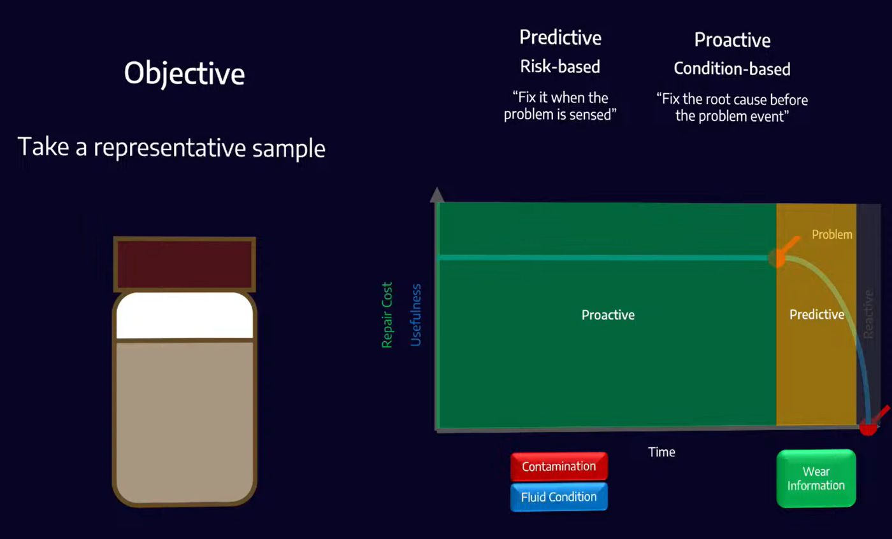

슬라이드의 곡선이 핵심입니다.
- **Proactive 구간**(초록, 시간축 대부분): 얻는 정보는 **오염도(Contamination)** 와 **유체 상태(Fluid Condition)**.
  수리비는 낮고 남은 수명은 길다 → **여기서 관리하는 것이 가장 싸다.**
- **Predictive 구간**(노랑, 후반): 얻는 정보는 **마모 정보(Wear Information)**.
  이미 손상이 진행 중이라 수리비가 올라간다.
- **Reactive**(맨 오른쪽 붕괴점): 비용 최대.

**"유지관리에 정답은 없다"** 를 보강하면 — 전략은 **자산의 중요도(criticality)** 로 배분합니다.
비상용 소형 펌프까지 오일 분석을 돌릴 필요는 없고, 라인 전체를 세우는 메인 기어박스를 달력 기준으로만
관리하면 안 됩니다. 실무에서는 **중요도 × 고장 결과** 로 등급을 나눠 Reactive~Proactive를 섞습니다.

---

## 3. 윤활의 기초 — 마찰, 윤활 영역, 유막

**원 메모**: "Boundary, mixed, hydrodynamic"

**보강** — 세 영역은 **유막 두께 대비 표면 조도(λ, lambda ratio)** 로 갈립니다.
(Stribeck 곡선: 속도·점도·하중의 조합에 따라 마찰계수가 어떻게 변하는지 보여주는 그래프)

| 윤활 영역 | λ (유막/조도) | 상태 | 무엇이 하중을 받치는가 | 지배 요소 |
|---|---|---|---|---|
| **Boundary** (경계) | λ < 1 | 돌기(asperity)끼리 접촉 | **첨가제 피막(AW/EP)** | 첨가제 화학 |
| **Mixed** (혼합) | 1 ≤ λ < 3 | 일부 접촉 + 일부 유막 | 유막 + 첨가제 | 둘 다 |
| **Hydrodynamic / EHL** | λ ≥ 3 | 완전 분리 | **유막(점성 압력)** | **점도**, 속도 |

- **Boundary**는 기동·정지, 저속 고하중, 왕복 운동의 반전점에서 필연적으로 발생합니다.
  → 그래서 AW(내마모)·EP(극압) 첨가제가 존재합니다.
- **Hydrodynamic**은 유막이 스스로 형성되므로 첨가제보다 **점도 선정**이 결정적입니다.

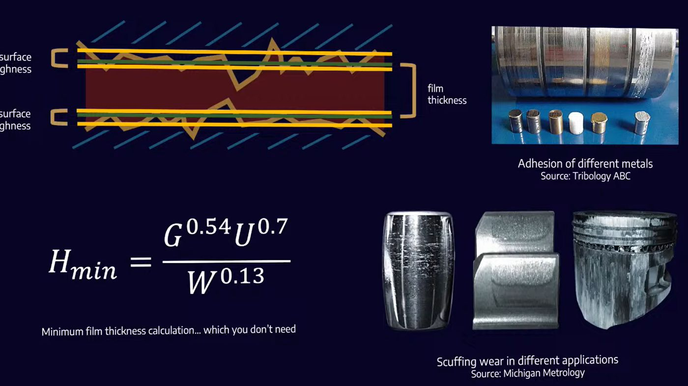

슬라이드의 최소 유막 두께 식 (강사도 "you don't need"라고 붙여둔 식):

$$H_{min} = \frac{G^{0.54} U^{0.7}}{W^{0.13}}$$

**보강 — 이 식에서 실제로 얻어갈 것은 지수입니다.**
- 속도 U의 지수 **0.7**, 재료·점도 파라미터 G의 지수 **0.54**
- 하중 W의 지수는 **0.13** (그리고 분모)

즉 **유막 두께는 하중보다 속도와 점도에 압도적으로 민감**합니다.
하중을 반으로 줄여도 유막은 거의 안 늘지만, 저속으로 떨어지거나 점도가 묽어지면 유막은 급격히 무너집니다.
→ **저속·고온 기동 순간이 가장 위험**하다는 실무 결론이 여기서 나옵니다.

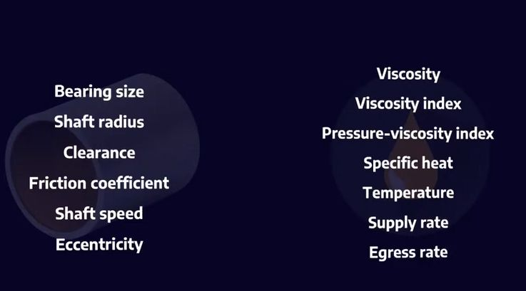

슬라이드는 유막이 **기계가 정하는 변수**(베어링 크기, 축 반경, 클리어런스, 마찰계수, 축 속도, 편심)와
**윤활유가 정하는 변수**(점도, 점도지수, 압력-점도 계수, 비열, 온도, 공급량, 배출량)의 **합**으로 결정된다는 뜻입니다.
정비 담당자가 바꿀 수 있는 쪽은 대체로 오른쪽(윤활유·공급 조건)입니다.

---

## 4. 윤활유의 구성 — 기유 + 첨가제

**원 메모**: "오일 = 기유와 첨가제만 / 그리스 = 기유, 증점제, 첨가제"

정확합니다. 이 구분이 그리스를 이해하는 출발점입니다.

```
오일   = 기유(Base Oil) + 첨가제(Additives)
그리스 = 기유(Base Oil) + 증점제(Thickener) + 첨가제(Additives)
```

### 4.1 기유 — API 그룹 분류 (보강)

| 그룹 | 종류 | 포화도/황분/VI | 특징 |
|---|---|---|---|
| **I** | 용제 정제 미네랄 | 포화<90% 또는 S>0.03%, VI 80–120 | 가장 저렴, 왁스 많음 |
| **II** | 수소처리 미네랄 | 포화≥90%, S≤0.03%, VI 80–120 | 현재 산업용 주력 |
| **III** | 고도 수소처리 (VHVI) | VI ≥ 120 | "합성유"로 판매 가능 |
| **IV** | **PAO** (폴리알파올레핀) | — | 저온 유동성·산화안정성 우수, 씰 호환 양호 |
| **V** | 그 외 (**에스테르, PAG**, 실리콘, 나프텐 등) | — | 특수 목적 |

**원 메모**: "PAG 폴리 알킬 글리콜 — 매우 우수한 성능, 산화안정성, 높은 윤활성. But 챌린지, 호환성이 좋지 않아"

**보강** — PAG는 정확히 그 트레이드오프를 가진 기유입니다.
- **장점**: 매우 높은 점도지수, 우수한 윤활성(웜기어·슬라이딩에서 특히 효율 이득), 열·산화 안정성, 슬러지를 거의 안 만듦
- **단점(챌린지)**:
  - **미네랄유·PAO와 혼합 불가**(비상용성) → 교체 시 완전 플러싱 필수
  - 일부 **씰·페인트·바니시**를 공격
  - 수용성 PAG는 **흡습성**이 커서 수분 관리가 까다로움
  - 가격
  → 그래서 PAG는 "전용 계통"으로 관리하는 것이 원칙입니다.

### 4.2 첨가제 — 무엇이 왜 들어가는가 (보강)

**원 메모**: "가장 많은 첨가제가 포함된 오일이 바로 엔진오일이다. RNO, 반전제? 세정제"

⚠️ 메모의 "RNO / 반전제"는 받아쓰기 과정에서 뭉개진 것으로 보입니다. 문맥상 **산화방지제(AO) ·
청정분산제(detergent/dispersant) · 내마모제(AW)** 를 가리키는 것으로 읽는 게 맞고,
엔진오일이 첨가제 함량 최다라는 결론 자체는 맞습니다(통상 10~25%).

| 분류 | 첨가제 | 역할 |
|---|---|---|
| **표면 보호** | AW (ZDDP 등) | 경계윤활에서 화학 피막으로 마모 방지 |
| | EP (황-인계) | 고하중에서 반응 피막 형성 (기어) |
| | 부식/방청 억제제 | 철·비철 표면 보호 |
| | 마찰조정제(FM) | 마찰계수 조정 (연비, 클러치) |
| **오일 보호** | 산화방지제 (AO) | 라디칼 사슬 차단 → 수명 결정 요소 |
| | 금속 불활성화제 | Cu·Fe의 촉매 작용 억제 |
| **성능 부여** | 점도지수 향상제 (VII) | 다등급화 (전단 안정성이 관건) |
| | 유동점 강하제 (PPD) | 저온 왁스 결정 성장 억제 |
| | 소포제 / 공기방출제 | 거품 억제 / 혼입공기 방출 |
| | 유화·해유화제 | 물과 섞이게/분리되게 |
| **오염물 제어** | 청정제 (detergent) | 표면 침적물 세정, 산 중화(TBN) |
| | 분산제 (dispersant) | 그을음·슬러지를 미세 분산 |

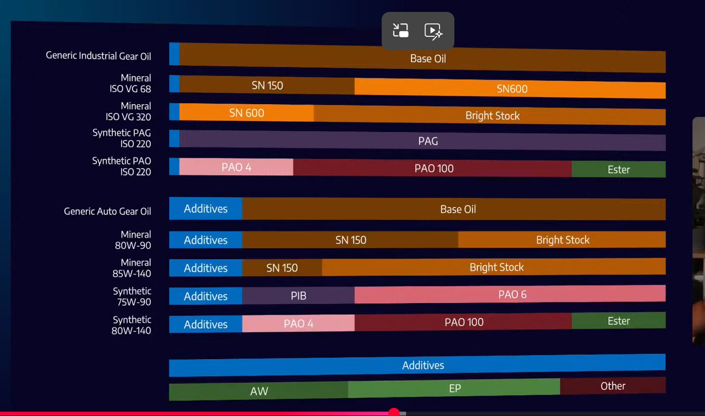

이 슬라이드는 **"같은 ISO 등급이라도 안이 완전히 다르다"** 를 보여줍니다.
산업용 기어오일은 첨가제 비율이 얇고 기유(SN150/SN600/Bright Stock)로 점도를 맞추는 반면,
자동차용 기어오일(80W-90, 85W-140)은 **첨가제 블록이 두껍고** 그 안에서 AW / EP / 기타로 다시 갈립니다.

---

## 5. 점도와 점도지수, 그리고 점도 선정

**보강** — MLA에서 가장 자주 나오는 단일 물성이 **점도**입니다.

- **동점도(kinematic viscosity)**: 40°C, 100°C에서 cSt(mm²/s), ASTM D445 / ISO 3104
- **ISO VG**: 40°C 동점도 중심값 ±10% (VG 32 = 28.8~35.2 cSt)
- **점도지수(VI)**: 온도에 따른 점도 변화의 **둔감함**. 높을수록 넓은 온도 범위에서 안정

### 5.1 베어링 점도 선정 — 속도와 온도의 함수

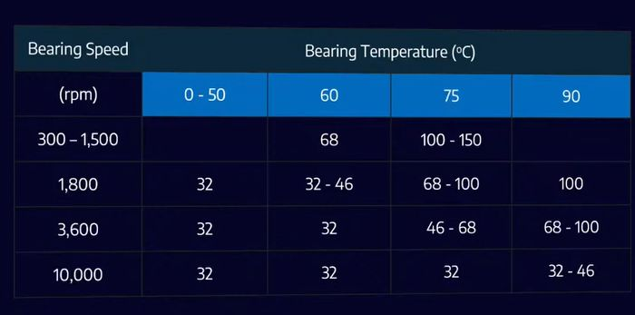

읽는 법: **속도가 높아지면 점도를 낮추고, 온도가 높아지면 점도를 올린다.**
(예: 1,800 rpm / 60°C → VG 32~46, 같은 속도에서 90°C면 VG 100)

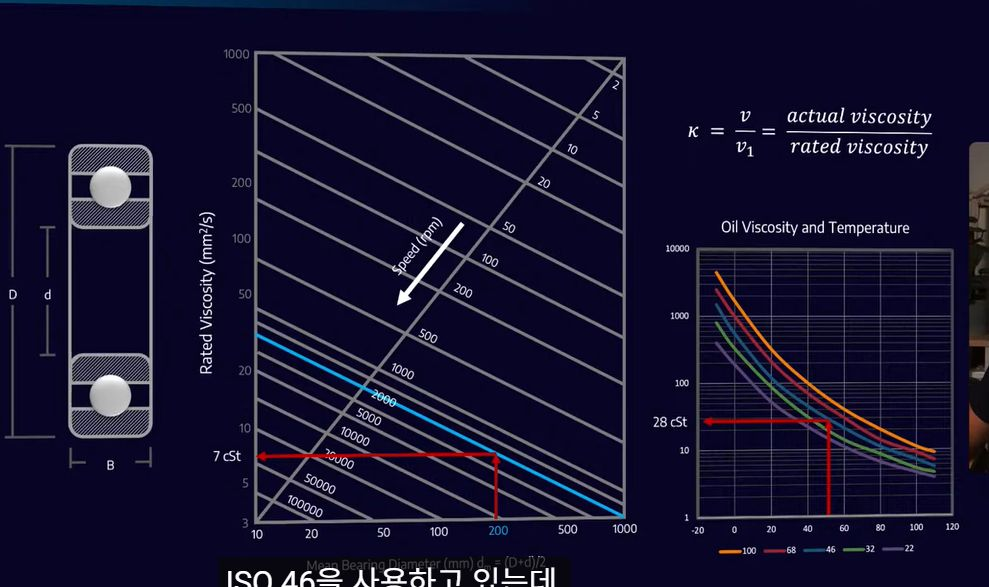

**보강 — 점도비 κ(kappa)**

$$\kappa = \frac{\nu}{\nu_1} = \frac{\text{실제 운전온도에서의 점도}}{\text{요구(정격) 점도}}$$

1. 노모그램에서 **평균 베어링 지름 d_m = (D+d)/2** 와 **회전수**로 요구 점도 ν₁을 읽고 (예: 7 cSt)
2. 점도-온도 선도에서 **선정한 오일이 운전온도에서 갖는 실제 점도** ν를 읽습니다 (예: ISO VG 46이 50°C에서 28 cSt)
3. κ = 28 / 7 = **4** → 여유 있는 완전 유막

실무 기준: **κ ≥ 1** 은 최소, **κ ≈ 2~4** 가 이상적, **κ < 1** 이면 경계윤활 → EP/AW 의존.
(κ가 지나치게 크면 처닝 손실·발열·에너지 낭비 — "점도는 높을수록 좋다"가 아닙니다.)

---

## 6. 그리스 — 구성, NLGI, 증점제

### 6.1 스펀지 비유

**원 메모**: "그리스 = 주방 스펀지 / 증점제 매트릭스가 오일 붙잡고 있다가 (풀어놓는다) / 거대한 섬유"
**원 메모(마무리)**: "그리스에서 증점제의 역할은 하중이 걸릴 때 기유를 고르게 분산시키는 역할"

정확한 이해입니다. 정리하면:

> 증점제는 **미세 섬유(fiber)·판상 구조의 3차원 매트릭스**를 만들어 기유를 머금고 있다가,
> **하중·전단·온도**가 걸리면 접촉부로 기유를 **내보내(bleed)** 실제 윤활을 하게 합니다.
> 즉 **일하는 것은 기유**, 증점제는 **기유를 그 자리에 붙잡아 두는 운반체**입니다.

이 한 문장에서 그리스의 실무 특성이 모두 따라옵니다 — 누유가 적고(밀봉 효과), 수직면·간헐 운전에 유리하지만,
**순환하지 않으므로 열을 못 빼고 오염물도 못 실어내며**, 오래되면 기유가 빠져(bleeding) 굳습니다.

### 6.2 NLGI 주도(consistency) 등급

**원 메모**: "National Lubricating Grease Institute" / "그리스 점도 = worked penetration" /
"NLGI 0 = centralized grease(펌핑 때문에), 2 = 굉장히 범용적"

⚠️ **정정**: NLGI 등급은 **점도가 아니라 주도(consistency, 굳기)** 입니다.
ASTM D217 **혼화주도(worked penetration)** — 25°C에서 60회 혼화한 시료에 표준 원추를 5초간 낙하시켜
침입 깊이를 0.1 mm 단위로 읽습니다. **숫자가 클수록 무르다.**

| NLGI | 혼화주도 (0.1 mm) | 질감(비유) | 주 용도 |
|---|---|---|---|
| 000 | 445–475 | 식용유 수준 | 기어·체인 유동성 필요 |
| 00 | 400–430 | 사과소스 | 중앙집중 급유, 기어박스 |
| **0** | **355–385** | 머스터드 | **중앙집중식(펌핑 거리 김), 저온** |
| 1 | 310–340 | 토마토 페이스트 | 저온, 중앙집중 |
| **2** | **265–295** | **땅콩버터** | **범용 (베어링 표준)** |
| 3 | 220–250 | 쇼트닝 | 고온, 수직축, 누유 방지 |
| 4 | 175–205 | 프로즌 요구르트 | 특수 |
| 5 | 130–160 | 부드러운 파테 | 특수 |
| 6 | 85–115 | 체다치즈 | 개방 기어, 실링 |

**중요**: NLGI 등급과 **기유 점도는 완전히 별개**입니다.
"NLGI 2"만 보고 선정하면 안 되고 **기유 점도(ISO VG)** 를 반드시 함께 확인해야 합니다
(고속 베어링 = 저점도 기유 + NLGI 2, 저속 고하중 = 고점도 기유 + NLGI 2 가 모두 존재).

### 6.3 증점제 계통과 성능

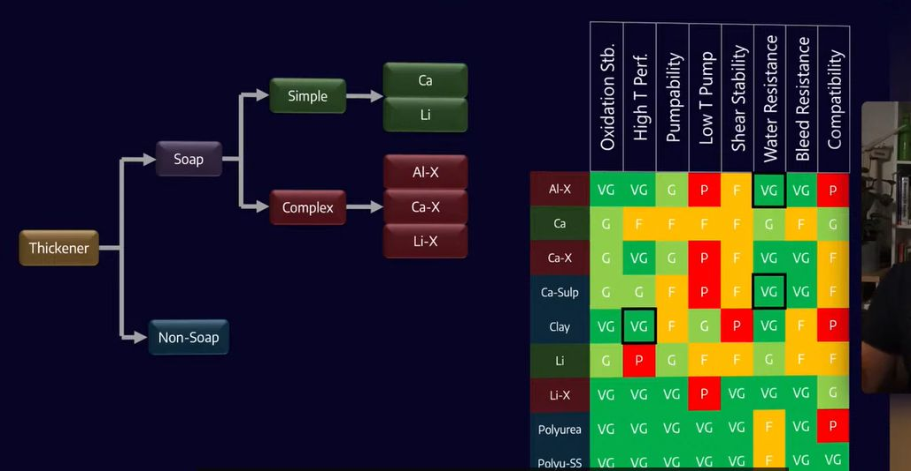

```
Thickener
├─ Soap (비누계)
│   ├─ Simple   : Ca, Li
│   └─ Complex  : Al-X, Ca-X, Li-X      ← 복합 비누(complex): 산을 추가해 성능 향상
└─ Non-Soap (비비누계) : Clay(벤토나이트), Polyurea, 실리카
```

**원 메모**
- "리튬 굉장히 범용적이다 — 전체 그리스 사용 70프로"
- "폴리우레아 — 다른 그리스와 섞이지 않지만 매우 뛰어나다"
- "칼슘 서포네이트 — 좋고 비싸다"

**보강 — 슬라이드 매트릭스 읽는 법** (VG=매우좋음, G=좋음, F=보통, P=나쁨)

| 증점제 | 강점 | 약점 | 대표 용도 |
|---|---|---|---|
| **Li (단순 리튬)** | 범용, 가격, 기계적 안정성 | **고온 성능 P**, 내수성 보통 | 범용 다목적 |
| **Li-X (리튬 복합)** | 전 항목 균형 우수, 고온 | **저온 펌핑성 P** | 산업 표준 다목적 |
| **Ca (단순 칼슘)** | **내수성**, 저렴 | 고온 한계(~80°C 분해) | 습한 저온 환경 |
| **Ca-X / Ca-Sulfonate** | 내수성·EP·방청 우수, 고온 | **저온 펌핑성 P**, 가격 | 제철·해양·습식 고하중 |
| **Al-X (알루미늄 복합)** | 산화안정성·**내수성 VG**, 점착성 | 호환성 P, 전단 안정성 F | 식품·연속주조 |
| **Clay (벤토나이트)** | **고온 VG**(용융점 없음) | 산화안정성·전단 F | 고온 저속 |
| **Polyurea** | 고온·산화안정성·**장수명 VG** | **호환성 P** | 밀폐형 전동기 베어링, sealed-for-life |

**리튬 70%**에 대한 보강: 리튬/리튬 복합이 세계 그리스 생산의 압도적 다수를 차지하는 것은 사실이지만,
최근 **리튬 수급·가격·규제(EU 유해성 분류 논의)** 때문에 대체 증점제 검토가 활발하고,
그 대안 1순위로 꼽히는 것이 바로 **과염기성 칼슘 설포네이트**입니다. 메모의 "좋고 비싸다"는 정확한 요약입니다.

### 6.4 그리스 호환성 — 실무에서 가장 자주 사고 나는 지점

**보강**: 서로 다른 증점제를 섞으면 **매트릭스 구조가 깨져** 다음 중 하나가 일어납니다.
- 물러져서 **흘러나감**(주도 급락) → 베어링 그리스 고갈
- 굳어서 **펌핑 불가**(주도 급상승) → 급유 라인 막힘
- **기유 분리(bleeding)** 가속

원칙:
1. 호환성 표를 확인한다(폴리우레아·알루미늄 복합·클레이는 특히 비호환 조합이 많음).
2. 확실치 않으면 **교체 시 완전 퍼지** — 통상 사용량의 **3~5배**를 밀어내거나 분해 세정.
3. 교체 직후 **온도·이음·그리스 상태를 짧은 주기로 재점검**.

**원 메모**: "그리스 색깔은 성능과 전혀 상관없다." ✅ 맞습니다.
착색은 **식별·브랜딩 용도**이며, 색으로 증점제나 성능을 판단할 수 없습니다
(다만 **현장 관리 목적의 색상 코드 표준화**는 매우 권장됩니다 — 잘못된 그리스 주입 방지).

### 6.5 그리스의 속도 한계 — 왜 고속에 불리한가

**원 메모**: "Dn rate? 그리스는 고속회전에 적합하지 않음. 대체로 저속에 유리."
"Thickener가 밀려나가고, 열을 제거할 수 없다? 오일은 가능하다네."

**보강** — 정확히 맞습니다. 세 가지 이유로 정리됩니다.

**속도 지표: ndm = n(rpm) × d_m(mm)**, d_m = (D+d)/2
(오일 기준 대략적 상한: 볼베어링 ≈ 400,000, 롤러베어링 ≈ 300,000 — 하중·설계에 따라 변동.
그리스는 이보다 **낮은 영역**에서만 안전하며, 고속 전용 그리스라도 오일 윤활의 상한에는 못 미칩니다.)

1. **열 제거 불가**: 그리스는 순환하지 않아 **전도(conduction)** 로만 열을 뺍니다.
   오일은 순환하면서 열을 하우징·쿨러로 실어냅니다 (오일 배스 < 오일 순환 < 오일 미스트/제트 순으로 냉각 능력 증가).
2. **원심 분리**: 고속에서 증점제가 원심력으로 **밀려나가고** 기유가 분리 → 접촉부 **기유 고갈(starvation)**.
3. **처닝(churning) 손실**: 그리스를 밀고 다니는 데 동력이 소모되고 그 자체가 발열원 → 산화 가속.

---

## 7. 용도별 윤활유 — 엔진 / 기어 / 유압 / 겸용유

### 7.1 엔진오일

**원 메모**: "엔진에서 윤활유 역할 — 복합적으로 수직 운동, 회전 운동이 복잡하게 얽혀 있다.
이럴 때는 가장 비싼 중요 부위의 최적화, 즉 **크랭크케이스 윤활에 집중**되어 있다. API ?"

**보강** — 좋은 관찰입니다. 엔진오일은 **하나의 오일이 서로 상충하는 요구를 동시에 만족**해야 합니다.

| 부위 | 윤활 조건 | 요구 |
|---|---|---|
| 크랭크샤프트/저널 베어링 | 유체윤활, 고속 | 점도, 유막 |
| 피스톤링–실린더 라이너 | **왕복 = 반전점마다 경계윤활** | AW, 청정성 |
| 캠/밸브트레인 | 고접촉압, 경계윤활 | AW(ZDDP), FM |
| 연소실 유입분 | 고온, 산·그을음 | 청정제(TBN), 분산제 |

그래서 첨가제 함량이 가장 많고, 성능은 **API 서비스 분류**로 표기합니다.
- **가솔린**: API S 계열 (현행 **SP**, 이전 SN PLUS/SN…) + ILSAC GF-6/GF-7
- **디젤**: API C 계열 (현행 **CK-4** = 하위호환 중시, **FA-4** = 저점도 HTHS 전용)
- 유럽은 **ACEA**(A/B, C, E 계열), 그 위에 **OEM 승인**(MB-Approval, VW, MAN, Volvo VDS 등)

⚠️ **정정 필요 — 원 메모**: "변속기에 엔진오일 사용해도 문제없다는 거다."
맞는 경우가 있지만 **일반화하면 위험**합니다.
- **가능한 경우**: OEM이 명시적으로 엔진오일 규격을 요구하는 일부 수동변속기/트랙터 계통,
  또는 애초에 겸용으로 설계된 **STOU**(§7.4).
- **위험한 경우**: 싱크로메시(황동/청동) — 엔진오일과 기어유의 **마찰특성 요구가 정반대**입니다.
  변속기는 싱크로 물림을 위해 특정 마찰계수가 필요한데 FM이 많은 엔진오일은 이를 방해할 수 있고,
  반대로 기어유의 황-인계 EP는 **황동을 부식**시킵니다.
→ 결론: **OEM 규격이 허용할 때만.** "된다"가 아니라 "규격을 본다"가 정답.

### 7.2 기어오일

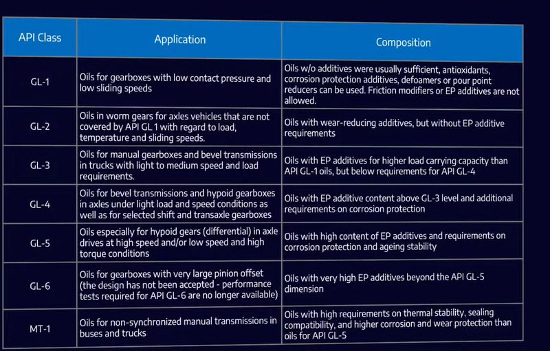

| API | 용도 | 조성 |
|---|---|---|
| **GL-1** | 저접촉압·저슬라이딩 기어박스 | 무첨가에 가까움. **FM·EP 불가** |
| GL-2 | 웜기어 | 마모방지 첨가제, EP 없음 |
| GL-3 | 트럭 수동변속기, 베벨 | 경도 EP (GL-4 미만) |
| **GL-4** | 베벨·하이포이드 (경하중) | EP + 방식 요구 → **수동변속기 표준** |
| **GL-5** | 하이포이드 차동장치 (고하중/고토크) | 고농도 EP → **디퍼렌셜 표준** |
| GL-6 | 초대형 피니언 오프셋 | 초고 EP (**현재 시험법 폐지, 사실상 사문화**) |
| MT-1 | 비동기 수동변속기(버스/트럭) | 열안정성·씰 호환·방식 강화 |

**보강 실무 주의**
- **GL-5를 GL-4 자리에 넣지 말 것**: 황-인계 EP가 싱크로의 **황동/청동을 부식**시킵니다
  (그래서 "GL-4/GL-5 겸용"이라 표기된 제품은 반드시 황동 호환 시험을 통과한 것인지 확인).
- 산업용 기어는 API 대신 **AGMA 등급 / ISO 6743-6 (CKB·CKC·CKD)** 와 **ISO VG**로 지정합니다.
- 웜기어는 슬라이딩이 지배적 → **컴파운드유(지방산 첨가)** 나 **PAG**가 유리(§4.1).

### 7.3 유압유 — 시험은 펌프가 결정한다

**원 메모**: "유압유에서 펌프가 가장 데미지 많이 남 / 유압유 (내마모)첨가제 상당량 /
유압유 선택에 매트릭스 / 점도지수 오른쪽"

**보강 — 규격 체계**

| 체계 | 코드 | 의미 |
|---|---|---|
| **ISO 6743-4** | HL | 산화방지 + 방청 |
| | **HM** | HL + **내마모(AW)** ← 산업 표준 |
| | **HV** | HM + **고점도지수** ← 이동장비/넓은 온도 |
| | HG | HM + 스틱슬립 방지(테이블) |
| | HFAE/HFAS/HFB/HFC | 수계 난연성 |
| | **HFDU / HFDR** | 무수 난연성 (**HFDR = 인산에스테르**) |
| **DIN 51524** | Part 1 = HL / **Part 2 = HLP** / **Part 3 = HVLP** | 독일 규격, 실무 인용 빈도 최고 |

**원 메모**: "Phosphate 에스테르 난연성 유체"
**보강**: 인산에스테르(HFDR)는 발전소 EHC/터빈 제어계에 쓰이는 대표 난연성 유체입니다. 다만
- **EPDM 씰 사용 불가**(부틸/불소계 사용), 일부 페인트·도료 공격
- **가수분해로 산 생성** → 흡착(풀러토/이온교환) 정화가 필수
- 미네랄유와 **완전 비호환**, 취급 시 보호구 필요
→ "난연성"이라는 장점 하나 때문에 **관리 부담이 크게 늘어나는** 유체입니다.

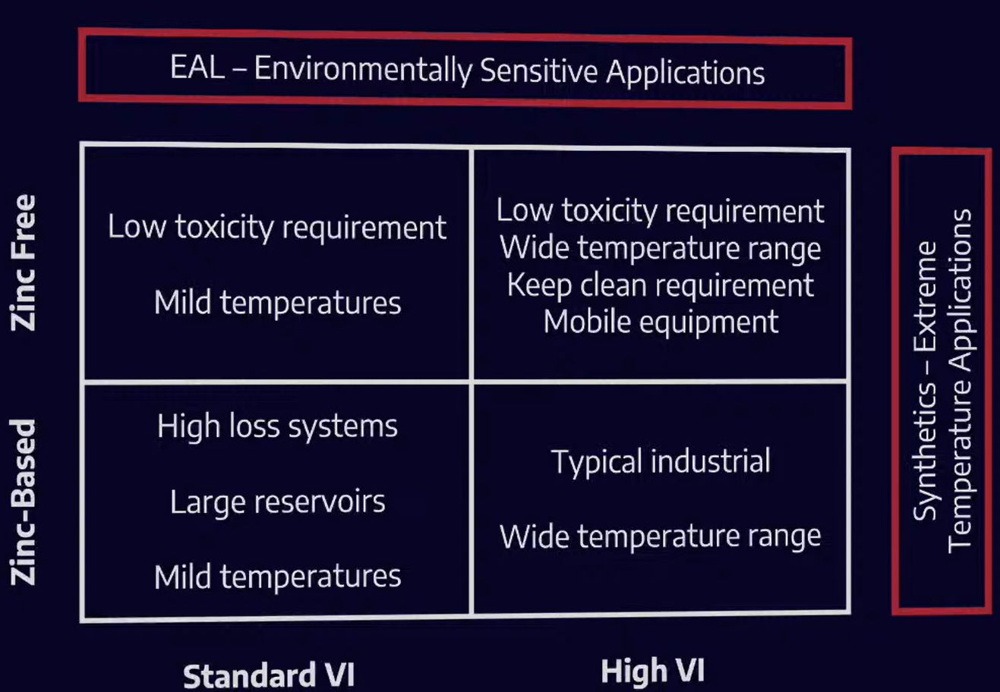
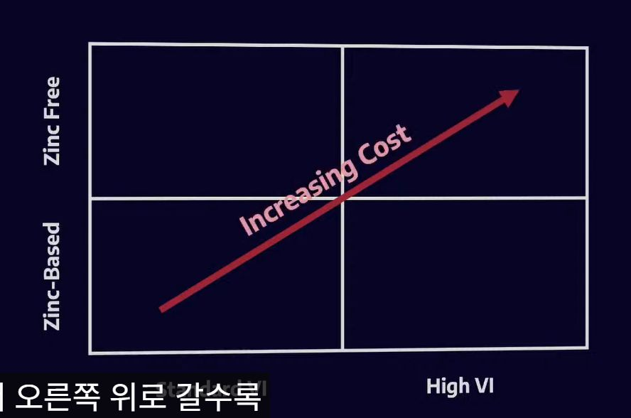

**사분면 읽는 법** (가로축 = 표준 VI → 고 VI, 세로축 = 아연계 → 무아연)

| | **Standard VI** | **High VI** |
|---|---|---|
| **Zinc Free** | 저독성 요구, 온화한 온도 | 저독성 + 넓은 온도 + 청정 요구 + **이동장비** |
| **Zinc-Based** | **손실 큰 시스템**, 대형 탱크, 온화한 온도 | **일반 산업용 표준**, 넓은 온도 |

- 사분면 위 = **EAL**(환경 민감 지역용 생분해성 유체), 오른쪽 밖 = **합성유**(극한 온도)
- **비용은 오른쪽 위로 갈수록 증가** → 두 번째 슬라이드가 이걸 화살표 하나로 말합니다.

**원 메모**: "항상 비싼 게 좋은 건 아니다? 근데 항상 누유되는 걸 얘기하는데.."
**보강 — 이건 정확히 사분면 좌하단의 논리입니다.**
누유·보충이 상시 발생하는 **High-loss 시스템**에 고급 합성유를 넣으면 그냥 땅에 돈을 버리는 셈입니다.
그 돈은 **누유를 잡는 데** 써야 하고, 유체는 표준 VI·아연계로 충분합니다.
반대로 서보밸브가 들어간 정밀 시스템은 유체를 아끼면 안 됩니다. **"비싼 오일"이 아니라 "맞는 오일"**.

**원 메모**: "왜 징크프리를 사용해야 할까. 고온에서 아연이 분해되면서 슬러지가 생길 수도 있다.
서보밸브는 굉장히 공차가 작기 때문에 유압 서보밸브에 영향을 줄 수 있다."
✅ 정확합니다. 보강하면 무아연(ashless)의 근거는 네 가지입니다.
1. **열분해/가수분해**: ZDDP가 고온·수분 존재 하에 분해되며 **불용성 슬러지·바니시** 생성
2. **서보/비례 밸브**: 스풀 공차가 수 µm 수준 → 바니시가 **스틱션·응답 저하**를 유발
3. **비철 부품**: 은·황동 계통 부식 우려
4. **환경/폐유 규제**: 회분(ash) 저감
→ 무아연 유압유는 슬러지 생성을 크게 낮추고 사용 수명을 늘리는 것으로 보고됩니다.

**원 메모**: "저온에서는 왁스 생성이 매우 적은 오일이 필요함. 따라서 점도가 매우 낮아야 한다고?"
⚠️ **정정**: 앞 문장은 맞지만 뒤 문장은 위험한 단순화입니다.
저온 성능을 결정하는 것은 **절대 점도 하나가 아니라**
- **유동점(pour point, ASTM D97)** 과 왁스 석출 거동 → PPD·기유 선택(수소처리유/PAO)
- **점도지수(VI)** → 저온 점도와 고온 유막을 동시에 만족시키는 열쇠
- 저온 겉보기 점도(Brookfield, ASTM D2983)

**운전온도에서 필요한 최소 점도(κ ≥ 1)는 반드시 지켜야** 하므로, 무조건 저점도가 아니라
**고VI + 낮은 유동점** 조합(= HV/HVLP, 합성)이 정답입니다.

### 7.4 겸용유 (UTTO / STOU)

**원 메모**: "트랙터 유압유(농기계) — 유압뿐 아니라 변속기까지 같이 적용하도록. 모든 기능을 한 번에.
슈퍼 트랙터 유니버설 오일도 있는데, 모든 부품, 엔진오일 역할까지 하는."

**보강** — 용어를 정리하면:

| 약어 | 이름 | 커버 범위 |
|---|---|---|
| **UTTO** | Universal Tractor Transmission Oil | 변속기 + 최종감속 + 유압 + 습식 브레이크/PTO 클러치 |
| **STOU** | Super Tractor Oil Universal | **UTTO + 엔진** |

- 장점: 농기계 현장에서 **오일 종류 수를 줄여** 오주입(cross-contamination) 위험과 재고를 줄임
- 대가: 어느 한 용도의 최적점은 아님(**타협 설계**). 특히 STOU는 엔진 요구(청정성·TBN)와
  습식 브레이크 마찰 요구를 동시에 만족해야 하므로 최신 저배기 엔진 규격에는 못 미치는 경우가 있음
- 실무: **John Deere J20C/J20D, Massey Ferguson M1135/M1145, Ford/New Holland FNHA-2-C-201** 등
  **OEM 승인 목록으로 선정**하는 것이 유일하게 안전한 방법

---

## 8. 규격과 OEM 시험

**원 메모**: "DIN standard, ISO standard" / "다양한 OEM"

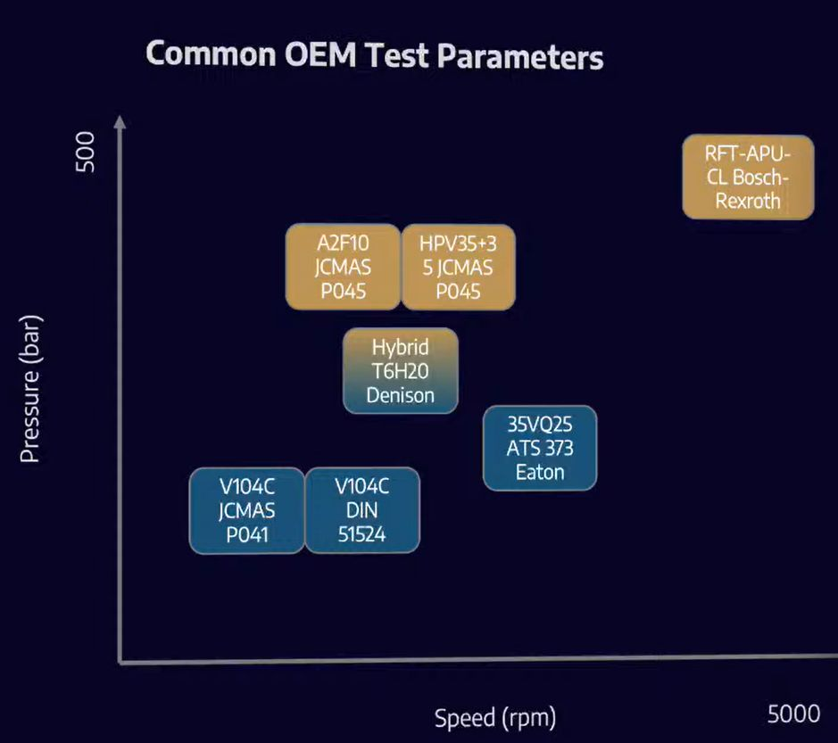

**보강** — 유압유의 "실력"은 결국 **펌프 시험**으로 증명합니다.
슬라이드는 각 시험이 커버하는 **압력(bar) × 속도(rpm)** 영역을 보여줍니다.

| 시험 | 펌프 형식 | 성격 |
|---|---|---|
| **V104C / DIN 51524, JCMAS P041** | Vickers 베인 | 기본 내마모 (저압·저속 영역) |
| **35VQ25 / Eaton ATS 373** | Vickers 베인 (고압) | 고속·고압 내마모, 업계 대표 관문 |
| **T6H20C / Denison HF-0 (hybrid)** | 베인 + 피스톤 **하이브리드** | 건식/습식 조건 모두, 가수분해 안정성 포함 |
| **A2F10 / HPV35+35 (JCMAS P045)** | 액셜 피스톤 | 고압 영역 |
| **RFT-APU-CL (Bosch Rexroth)** | 피스톤 | **최고압·최고속** — 가장 가혹 |

읽는 법: 내 장비의 펌프 형식·압력·속도가 그래프에서 어디쯤인지 확인하고,
**그 영역을 커버하는 시험을 통과한 유체**를 고르면 됩니다. "고급유"라는 말보다 이 목록이 훨씬 정확합니다.
(JCMAS = 일본건설기계공업회, DIN = 독일, ISO = 국제, 그리고 개별 OEM 승인)

---

## 9. 오일은 어떻게 죽는가 — 열화 4가지 + 첨가제 소모

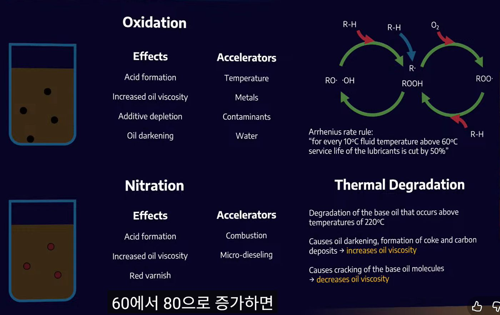

### 9.1 산화 (Oxidation) — 모든 열화의 기본

라디칼 연쇄 반응입니다: R-H → R· → ROO· → ROOH → … (자가 촉진)

| 결과(Effects) | 촉진 인자(Accelerators) |
|---|---|
| **산 생성** (TAN 상승) | **온도** |
| **점도 상승** | **금속** (Cu, Fe = 촉매) |
| **첨가제 소모** | **오염물** |
| 오일 색 어두워짐 | **수분** |

**보강 — Arrhenius 규칙 (시험 필수 암기)**
> **60°C를 넘는 구간에서 유체 온도가 10°C 상승할 때마다 윤활유 수명은 절반이 된다.**

메모 옆 자막의 "60에서 80으로 증가하면" → **10°C씩 두 번 = 수명 1/4**.
반대로 **쿨러 하나로 10°C를 내리면 오일 수명이 2배**가 된다는 뜻이기도 합니다.
(그래서 §18의 3원칙 중 "cool"이 들어갑니다.)

### 9.2 질화 (Nitration) — 연소 엔진, 특히 천연가스 엔진

| 결과 | 촉진 인자 |
|---|---|
| 산 생성 | **연소(blow-by)** |
| 점도 상승 | **마이크로디젤링** |
| **적색 바니시(red varnish)** | |

NOx가 오일과 반응 → 니트로 화합물 → 특유의 **붉은 바니시**. 가스엔진 오일 진단의 핵심 지표입니다.

### 9.3 열분해 (Thermal Degradation) — 220°C 이상

- 산화와 달리 **산소 없이도** 일어나는 기유 자체의 파괴
- **코크·카본 침적, 오일 흑화** → **점도 상승**
- 동시에 기유 분자의 **크래킹** → **점도 하락**
  (→ 그래서 열분해가 진행된 오일은 점도가 올라갈 수도, 내려갈 수도 있습니다. 시험 함정 포인트)
- 국부 고온원: 마이크로디젤링(기포가 고압에서 압축될 때 국부적으로 수백~1000°C), 전기방전, 뜨거운 표면

### 9.4 가수분해 (Hydrolysis) — 물이 만드는 산

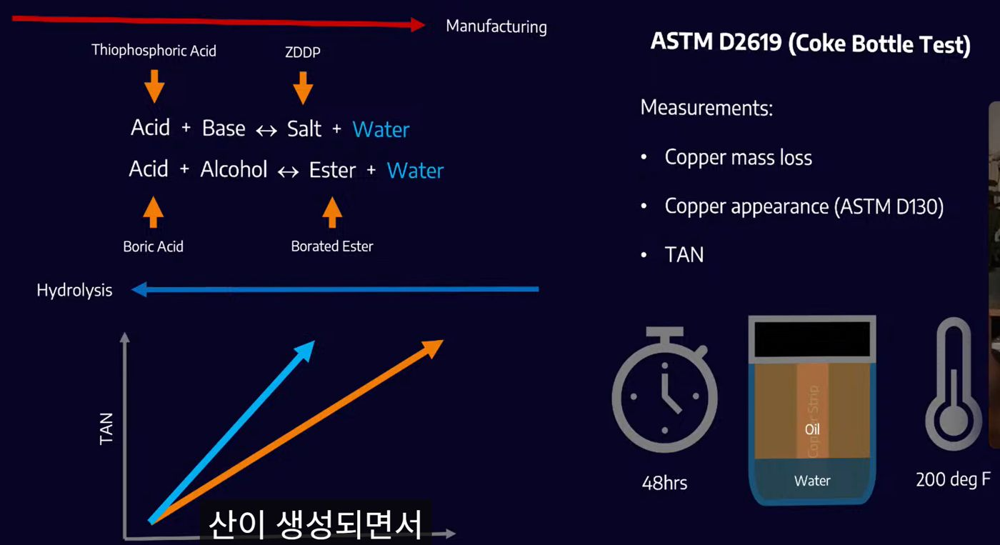

제조 방향(→)의 반응이 물이 있으면 **역방향(←)** 으로 돌아갑니다.

```
산 + 염기  ↔  염  + 물        (ZDDP ← 티오인산)
산 + 알코올 ↔ 에스테르 + 물    (붕산화 에스테르 ← 붕산)
```

즉 **에스테르계 기유와 ZDDP·붕산화 첨가제는 수분이 있으면 분해되어 산을 만들고**, TAN이 상승하며
**구리를 부식**시킵니다. 이것이 §7.3에서 무아연을 쓰는 이유이자, §11에서 수분을 잡는 이유입니다.

**보강 — ASTM D2619 (Coke Bottle Test, 가수분해 안정성)**
- 오일 + 물 + **구리 시편**을 밀봉 병에 넣고 **93°C(200°F), 48시간** 회전
- 측정: **구리 질량 손실**, **구리 외관(ASTM D130)**, **TAN 변화**
- Denison HF-0 등 고급 유압유 승인의 필수 항목

### 9.5 첨가제 소모 (Additive Depletion)

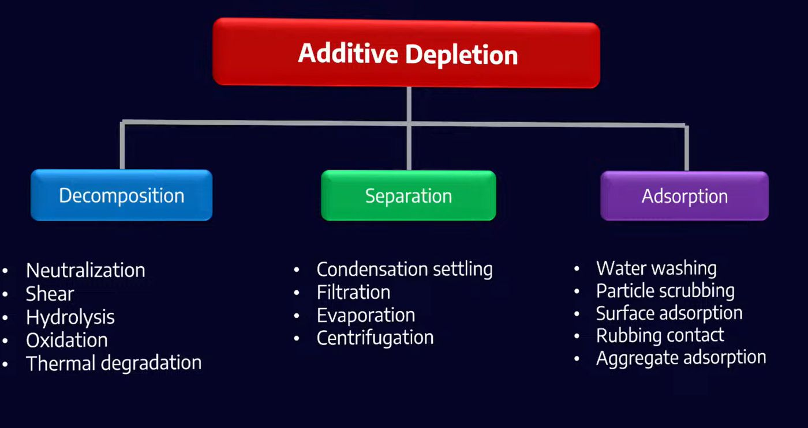

첨가제는 "닳는" 게 아니라 **세 경로**로 사라집니다 — 이 분류가 MLA 시험 단골입니다.

| 경로 | 메커니즘 |
|---|---|
| **분해 (Decomposition)** | 중화, **전단(shear)**, 가수분해, 산화, 열분해 |
| **분리 (Separation)** | 응축·침전, **여과(filtration)**, 증발, 원심분리 |
| **흡착 (Adsorption)** | **물 세척(water washing)**, 입자 스크러빙, 표면 흡착, 마찰 접촉, 응집체 흡착 |

**실무 함의 (중요)**
- **여과와 원심분리는 첨가제를 빼앗아 갈 수 있다** — 특히 소포제(실리콘)와 일부 극성 첨가제.
  §12의 슬라이드도 "소포제가 여과로 제거되지 않게 하라"고 명시합니다.
- **물 세척**은 청정제·방청제 같은 극성 첨가제를 물 쪽으로 끌고 나갑니다.
- 즉 **오염물 제거와 첨가제 보존은 트레이드오프**이며, 정화 장비 선정 시 반드시 고려해야 합니다.

---

## 10. 오염 관리 ① 입자와 ISO 4406

**원 메모**: "유압시스템의 고장은 80프로가 오염된 오일 기반, 즉 매우 중요한 요소"

**보강**: 유압·윤활 계통 고장의 대다수가 오염(입자·수분)에 기인한다는 것은 업계의 표준 인식입니다
(출처에 따라 70~90%로 인용). 정확한 숫자보다 중요한 결론은 **"오염 관리가 최우선 proactive 활동"** 입니다.

### 10.1 ISO 4406 청정도 코드 읽기

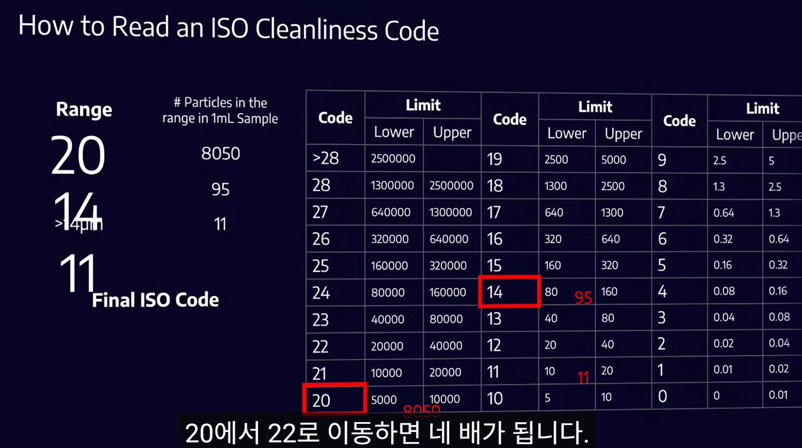

**형식: `>4µm / >6µm / >14µm`** 각 크기 이상 입자의 **1 mL당 개수**를 코드로 변환한 3자리 코드.

슬라이드 예시:
| 측정 (1 mL) | 개수 | 코드 |
|---|---|---|
| >4 µm | 8,050 개 | **20** (5,000–10,000) |
| >6 µm | 95 개 | **14** (80–160) |
| >14 µm | 11 개 | **11** (10–20) |

→ **최종 코드 20/14/11**

**핵심 규칙 (자막에도 나온 부분)**
> 코드 **1 증가 = 입자수 2배**, 코드 **2 증가 = 4배**.
> 반대로 **코드 1을 낮추면 오염 입자를 절반으로 줄인 것**입니다.

| 코드 | 1 mL당 입자수 범위 |
|---|---|
| 24 | 80,000 – 160,000 |
| 22 | 20,000 – 40,000 |
| 20 | 5,000 – 10,000 |
| 18 | 1,300 – 2,500 |
| 16 | 320 – 640 |
| 14 | 80 – 160 |
| 12 | 20 – 40 |
| 10 | 5 – 10 |

### 10.2 목표 청정도 (보강)

| 계통 | 권장 목표 (대략) |
|---|---|
| **서보/비례 밸브, 고압(>250 bar)** | **16/14/11 이하** |
| 일반 산업용 유압(피스톤/베인) | 18/16/13 |
| 저압·기어펌프 | 20/18/15 |
| 롤링 베어링·기어박스 | 17/15/12 ~ 19/17/14 |
| 터빈 제어유 | 15/13/10 이하 |

목표 청정도를 두 코드 개선하면 부품 수명이 **수 배** 늘어난다는 것이 여러 문헌·OEM 자료의 공통 결론입니다.
**"오일을 자주 교환"보다 "오일을 계속 깨끗하게"** 가 훨씬 효과적인 이유입니다.

### 10.3 입자 계수 방법

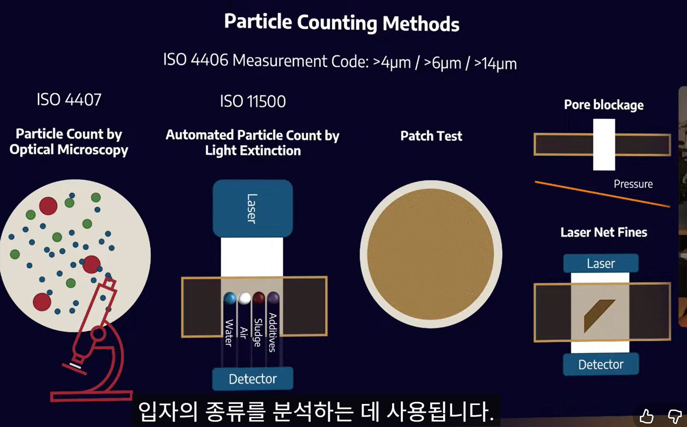

| 방법 | 규격 | 특징 / 한계 |
|---|---|---|
| **광학 현미경 계수** | **ISO 4407** | 기준(중재)법. 정확하지만 느리고 사람 손이 필요 |
| **자동 광차폐(Light Extinction)** | **ISO 11500** | 실무 표준. 빠름. **단, 물방울·기포·슬러지를 입자로 오인** |
| **패치 테스트(Patch Test)** | — | 멤브레인에 걸러 **눈으로 종류 판별**(금속/모래/섬유/그리스) — 정성 정보가 강점 |
| **Pore blockage** | — | 차압으로 추정. **어둡거나 물기 많은 오일**에도 사용 가능 |
| **Laser net fines** | — | 미세분 추정 |

**실무 팁**: 자동 계수 결과가 갑자기 튀면 **먼저 수분과 공기를 의심**하십시오
(진짜 입자가 늘었는지 확인하려면 패치 테스트나 재탈기 후 재측정).

---

## 11. 오염 관리 ② 수분

**원 메모**
- "물이 오일로 들어가는 이유 — 많은 오일이 흡습성이 있기 때문(물을 끌어당긴다). 대기 중의 수분까지 흡수할 정도다."
- "Free water(자유수) — 오일 종류에 따라 분리가 잘되는 오일 / 안 되는 오일 있음."
- "가장 제거하기 어려운 물은 유화수, 용해수."

### 11.1 물의 세 가지 상태

| 상태 | 모습 | 제거 난이도 |
|---|---|---|
| **용해수 (Dissolved)** | 눈에 안 보임. 분자 단위로 녹아 있음 | ★★★ **가장 어렵다** |
| **유화수 (Emulsified)** | 우유처럼 흐림(hazy/cloudy) | ★★ |
| **자유수 (Free)** | 바닥에 층으로 고임 | ★ 쉬움 (드레인) |

⚠️ **정정**: 메모는 "유화수, 용해수"를 함께 묶었지만, 정확히는 **용해수가 가장 어렵습니다.**
자유수·유화수는 진공탈수기로 **거의 100% 제거**되는 반면 용해수는 **약 90%** 수준에 그치고 시간도 오래 걸립니다.

### 11.2 포화점 (Saturation Point) — 메모의 "흡습성"을 정량화

- **포화점** = 오일이 용해 상태로 붙잡을 수 있는 물의 **최대량**. 이 선을 넘으면 **유화 → 자유수**로 나옵니다.
- 일반 유압유·터빈유: **대략 200~400 ppm** (기유·첨가제·열화 정도에 따라 크게 변동)
- **온도에 강하게 의존**: 뜨거울 때는 더 많이 녹아 있다가 **식으면 포화점이 낮아져 물이 석출**됩니다.
  → 운전 중에는 맑았던 오일이 **정지 후 흐려지거나 바닥에 물이 고이는** 현상의 원인.
- 열화된 오일(산화 생성물 = 극성)은 **포화점이 올라가** 더 많은 물을 품습니다(그래서 "괜찮아 보임"에 속기 쉬움).

### 11.3 물이 들어오는 경로와 피해 (보강)

**경로**: 대기 호흡(브리더) → 온도 변화로 **응축**, 씰 누설, 오일쿨러 누설, 세척수·우수 침입,
연소 부산물, 보관 중 드럼 상부 고임물 흡입

**피해** (수분이 왜 "입자와 함께 2대 오염물"인가)
- **산화 촉진**(촉매 금속과 함께면 가속), **가수분해**로 산 생성 (§9.4)
- **유막 파괴** — 물은 압력을 못 받침 → 경계윤활화
- **부식**, 그리고 고압 구간에서 **수소취화(hydrogen embrittlement)** → 베어링 조기 박리
- **첨가제 유출**(water washing, §9.5), **미생물 성장**, 저온에서 **결빙**

**제거 수단**

| 방법 | 자유수 | 유화수 | 용해수 |
|---|---|---|---|
| 정지 후 드레인 / 침전 | ◎ | △ | ✕ |
| 원심분리 | ◎ | ○ | ✕ |
| 흡습(water-absorbing) 필터 | ○ | ○ | △ |
| 응집(coalescer) | ◎ | ○ | ✕ |
| **진공탈수(Vacuum dehydration)** | ◎ | ◎ | **○ (~90%)** |
| **건조제 브리더 (예방)** | — | — | **최고의 투자** |

> **결론**: 물은 **빼는 것보다 안 들어오게 하는 것**이 압도적으로 쌉니다(브리더·씰 관리).

---

## 12. 오염 관리 ③ 공기와 거품

**원 메모**: "에어에도 종류가 있다. 가장 위험한 에어 — 일반적으로 거품을 걱정하는데 but,
**혼입공기가 가장 문제**가 됨. 펌프로 빨려 들어가면 캐비테이션 문제. 브레이크 예를 들어 브레이크가 안 잡힘."

✅ 정확한 포인트입니다.

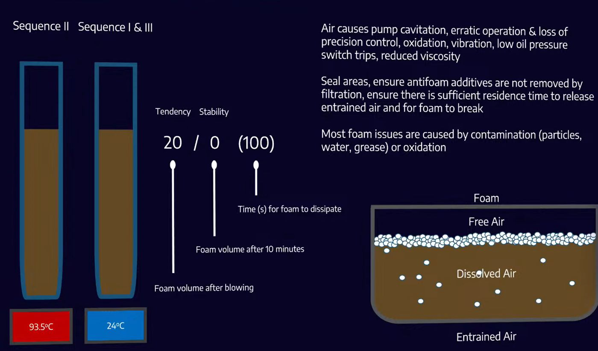

| 형태 | 설명 | 위험도 |
|---|---|---|
| **용해 공기 (Dissolved)** | 분자 단위로 녹아 있음. 광유는 통상 **약 8~10 vol%** | 정상. 무해 |
| **혼입 공기 (Entrained)** | 오일 속에 **미세 기포로 분산** | ⚠️ **가장 위험** |
| **거품 (Foam)** | 표면에 뜬 기포층 | 눈에 보여서 신고는 되지만 상대적으로 덜 치명적 |
| **자유 공기 (Free)** | 갇힌 공기 포켓 | 계통 상단·데드존 |

**혼입 공기가 왜 최악인가** (슬라이드 우측 텍스트 그대로)
- **펌프 캐비테이션** — 기포가 고압에서 붕괴하며 금속을 깎아냄
- **불규칙 동작 및 정밀 제어 상실** — 유체가 **압축성**을 가지게 됨
  → 메모의 "브레이크가 안 잡힘"이 정확히 이것입니다(스펀지 현상). 서보 응답 지연도 동일 원리.
- **산화 촉진**(산소 공급 + 마이크로디젤링), **진동**, **저유압 스위치 트립**, **겉보기 점도 저하**

**대책** (슬라이드)
- 씰 영역 점검(부압 구간 흡입 방지), **소포제가 여과로 제거되지 않도록** 주의(§9.5),
  **탱크 체류시간 확보**(공기 방출·거품 붕괴 시간), 리턴 라인이 유면 아래로 들어오게 배관,
  탱크 내 배플·유속 관리
- **원인 추적**: 거품 문제의 대부분은 **오염(입자·물·그리스 혼입)이나 산화** 때문입니다.
  → 소포제를 추가로 붓는 것은 대개 잘못된 처방(과주입은 **공기 방출성을 악화**시킵니다).

**보강 — 시험법**
- **ASTM D892 (기포성)**: Sequence **I = 24°C**, Sequence **II = 93.5°C**, Sequence **III = 24°C(II 시료 재시험)**.
  결과는 **거품 경향(tendency) / 안정성(stability)** 으로 표기 → 슬라이드의 `20 / 0 (100)`은
  "블로잉 직후 거품 20 mL, 10분 후 0 mL, 거품 소멸까지 100초"로 읽습니다.
- **ASTM D3427 (공기 방출성, air release)**: **혼입 공기**를 다루는 시험 —
  거품(D892)과 혼동하기 쉬운 별개 항목이며, 실무에서 더 중요한 경우가 많습니다.

---

## 13. 마모 — 4가지 기본 메커니즘

**원 메모**: "어떻게 마모가 되는지. 표면마모, 접착마모"

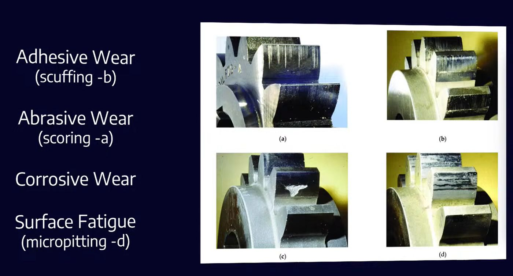

| 마모 | 별칭(슬라이드) | 메커니즘 | 원인 / 대책 |
|---|---|---|---|
| **접착 마모 (Adhesive)** | **scuffing** (b) | 유막이 끊겨 금속끼리 **응착·이탈** | 유막 부족·과부하·과열 → 점도↑, EP/AW |
| **연삭 마모 (Abrasive)** | **scoring** (a) | 경질 입자가 표면을 **긁음** | **오염 입자** → 여과·청정도 (§10) |
| **부식 마모 (Corrosive)** | (c) | 산·물이 표면을 **화학적으로** 공격 | 수분·산 관리 (§9.4, §11) |
| **표면 피로 (Surface Fatigue)** | **micropitting** (d) → spalling | 반복 접촉응력에 의한 **아래로부터의 균열** | 유막 부족(λ↓), 조도, 과부하 |

**보강 — MLA에서 함께 나오는 마모 형태**
- **Erosive**: 고속 유체·입자가 표면을 침식 (밸브 시트, 오리피스)
- **Cavitation**: 기포 붕괴 (§12) — 펌프 흡입부
- **Fretting**: 미세 왕복 진동 + 산화 → 적갈색 분말 (운송 중 정지 베어링, 압입부)
- **Electrical pitting**: 축전류·VFD 방전 → 프로스팅/플루팅 (전동기 베어링)

**연결 포인트**: 마모 형태를 알면 **오일 분석 결과의 해석 방향**이 정해집니다.
Si + Al 상승 → 외부 먼지 유입 = abrasive 의심. Cu 상승 + TAN 상승 → corrosive 의심.
Fe 대형 입자(PQ) 상승 → surface fatigue/spalling 의심.

---

## 14. 오일 분석의 기본 — 샘플링이 8할

**원 메모**
- "샘플링, 채취 방법, 위치가 중요 (**대표하는 오일**이기 때문에)"
- "대표 샘플을 위해 — 샘플 bottle의 청결도"
- "펌프 손상이 예상되면, **펌프 후단, 필터 전단**에서 샘플링해야 함. 반면 베어링이라면…"

✅ 이 세 줄이 오일 분석의 핵심입니다. 슬라이드 제목도 그대로 **"Objective: Take a representative sample"**.

### 14.1 대표성 확보 3원칙

1. **데이터 밀도를 최대화**한다 — 부품 **하류**, 필터 **상류**
2. **데이터 왜곡을 최소화**한다 — 병·기구·데드볼륨의 오염 배제
3. **일관성을 유지**한다 — 같은 지점, 같은 방법, 같은 온도·부하, 같은 주기

### 14.2 위치 선정 (보강)

| 원칙 | 이유 |
|---|---|
| **가동 중, 정상 운전온도**에서 채취 | 정지하면 입자가 침전되어 실제보다 깨끗하게 나옴 |
| **필터 상류** | 필터 하류는 필터가 정보를 걸러버림 = "data stripper" |
| **부품 하류** | 마모 정보가 실려 있는 오일 |
| **난류 구간(엘보 등)** | 입자가 균일하게 섞여 있음 |
| **탱크 바닥·데드존 회피** | 침전물이 과대 평가됨 |
| 압력 라인은 **전용 샘플 밸브(민메스 등)** 사용 | 재현성 |

→ 메모의 "펌프 손상 예상 시 **펌프 후단 · 필터 전단**"은 바로 이 원칙의 적용입니다.
베어링이 대상이라면 **해당 베어링 배출(리턴) 라인**에서 채취해야 그 베어링의 정보를 얻습니다.
(플랜트에서는 통상 **1차 지점 = 모든 리턴이 합류한 뒤 탱크 유입 전**,
**2차 지점 = 펌프 직후 / 각 베어링 직후**로 계층을 나눕니다.)

### 14.3 실무 체크리스트

- **병 청결도**: 분석 목표 청정도보다 **깨끗한 등급의 병**을 사용(청정 인증 병). 일반 페트병 절대 금지
- **데드볼륨 플러싱**: 채취 라인 부피의 **5~10배**를 흘려버린 뒤 채취
- 병은 **채취 직전에 개봉, 즉시 밀봉**. 뚜껑을 뒤집어 놓지 않기
- **80% 이하로 채우기** (실험실에서 흔들어 섞어야 함)
- **라벨**: 설비ID, 지점, 일시, 오일 종류/사용시간, 보충량, 운전 조건 — **누락 시 트렌드가 죽습니다**
- **주기 고정**: 중요 설비는 짧게, 변경 후에는 임시 추가 샘플

---

## 15. 분석 항목과 시험 규격

**원 메모**: "Oil analysis basics." / "기계 오일 분석 — STLE"

**보강** — 오일 분석 결과지는 **§2의 3범주**로 읽습니다.

### 15.1 유체 상태 (Fluid Condition) — "오일이 아직 쓸 만한가"

| 항목 | 규격 | 의미 / 경보 방향 |
|---|---|---|
| **동점도 40/100°C** | ASTM D445, ISO 3104 | ±10% 이탈 시 조사. 상승=산화/오염/오주입, 하락=연료희석/전단/크래킹 |
| **TAN (산가)** | ASTM D664 | 산화 진행 지표. **초기값 대비 증가폭**으로 판정 |
| **TBN (염기가)** | ASTM D2896 / D4739 | 엔진오일 잔여 중화 능력 (통상 초기의 50% 소진 시 경보) |
| **FTIR** | ASTM E2412 | 산화·질화·황화, 수분, 글리콜, 그을음을 한 번에 스크리닝 |
| **RPVOT** | ASTM D2272 | 잔여 산화 수명 (터빈유 핵심) |
| **MPC (바니시 potential)** | ASTM D7843 | 침적물 생성 경향 — 터빈·서보 계통 |
| **해유화성 / 기포성 / 공기방출** | D1401 / D892 / D3427 | §12 |

### 15.2 오염 (Contamination) — "무엇이 들어왔나"

| 항목 | 규격 | 비고 |
|---|---|---|
| **입자 계수 (ISO 4406 코드)** | ISO 11500 / ISO 4407 | §10 |
| **수분** | ASTM **D6304 (Karl Fischer)** = ppm, D95(증류), 크래클 시험(현장) | §11 |
| **Si, Na, K, B** (ICP) | ASTM D5185 | 먼지(Si), 부동액·해수(Na/K), 냉각수(B) |
| 연료 희석 / 그을음 | GC, FTIR | 디젤엔진 |
| **패치 / 페로그래피** | — | 입자의 **정체**를 눈으로 확인 |

### 15.3 마모 (Wear) — "어디가 닳고 있나"

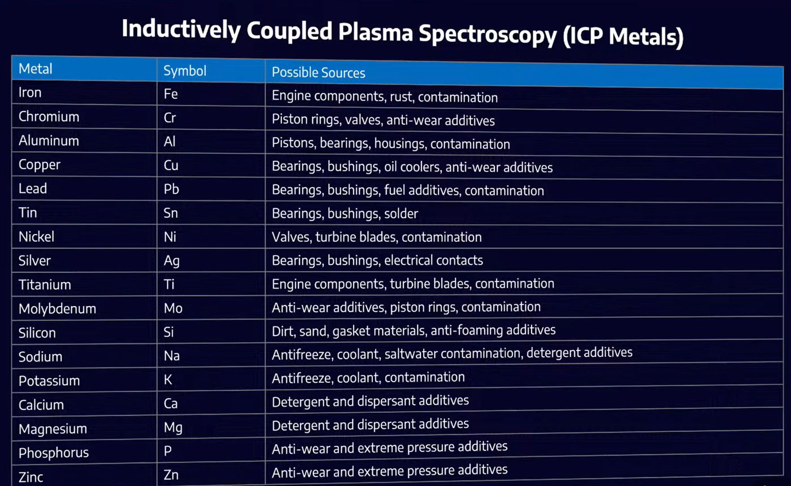

**ICP (유도결합플라즈마 발광분광, ASTM D5185)** — 원소를 ppm 단위로 정량.
슬라이드 표를 **성격별로 다시 묶으면** 해석이 쉬워집니다.

| 성격 | 원소 | 대표 발생원 |
|---|---|---|
| **마모 금속** | **Fe** | 엔진 부품, 기어, 녹 |
| | **Cr** | 피스톤링, 밸브 (+ AW 첨가제) |
| | **Al** | 피스톤, 베어링, 하우징 |
| | **Cu** | **베어링, 부싱, 오일쿨러** (+ AW 첨가제) |
| | **Pb / Sn / Ag** | 베어링, 부싱, 솔더, 전기 접점 |
| | **Ni / Ti** | 밸브, 터빈 블레이드 |
| **오염물** | **Si** | **먼지·모래**, 개스킷, (+ 소포제) |
| | **Na / K** | **부동액·냉각수, 해수**, (+ 청정제) |
| | **B** | 냉각수 첨가제 |
| **첨가제** | **Ca / Mg** | 청정·분산제 |
| | **Zn / P** | **AW·EP (ZDDP)** |
| | **Mo** | AW/마찰조정제 (+ 피스톤링) |

⚠️ **ICP의 결정적 한계 (보강, 시험 단골)**
> ICP는 **대략 5~8 µm보다 큰 입자를 제대로 검출하지 못합니다.**
> 큰 조각으로 떨어져 나오는 **피로 박리(spalling)** 는 ICP에서 안 보일 수 있습니다.

따라서 마모 진단은 항상 **조합**으로 합니다:
**ICP(미세 마모 트렌드) + PQ 지수/자성 입자(대형 Fe) + 입자 계수 + 페로그래피/패치(형태 판별)**.
"ICP가 정상이니 괜찮다"는 판단은 위험합니다.

### 15.4 판정의 원칙

- **절대값보다 트렌드**: 동일 지점·동일 주기의 **변화율(rate of change)** 이 진짜 신호
- **한계치**: OEM 기준 → 실험실 통계 기준 → 사내 이력 기준 순으로 우선
- **교차 확인**: 하나의 이상 값으로 결론 내지 말고 **다른 항목과 일관성** 확인
  (예: Cu 단독 상승은 오일쿨러 신품에서 흔한 정상 현상일 수 있음)
- **이상 시 절차**: 재샘플 → 확인 → 원인 조사 → 조치 → 조치 후 재샘플

---

## 16. 여과와 청정 유지

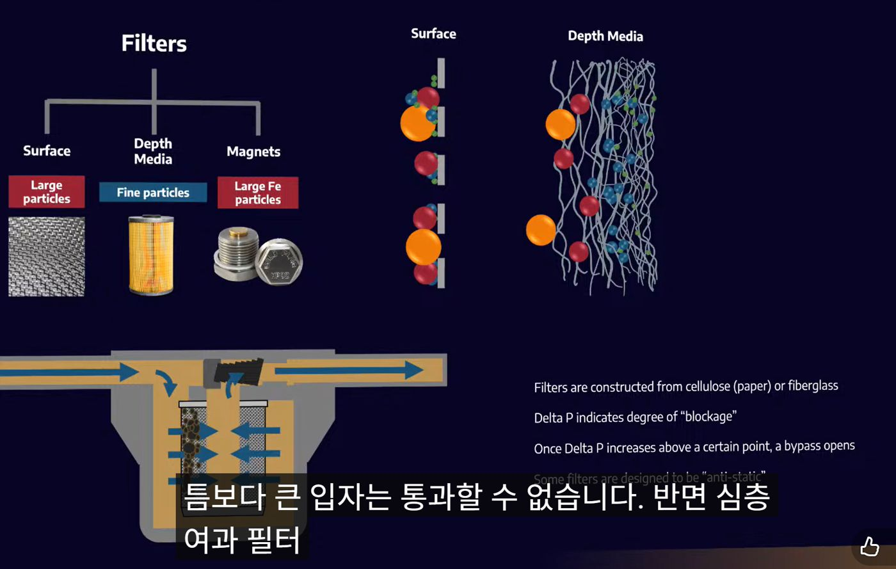

| 종류 | 잡는 것 | 특징 |
|---|---|---|
| **Surface (표면 여과)** | **큰 입자** | 주름진 메시. 구멍보다 큰 입자는 통과 못 함. **절대 여과**에 가까움 |
| **Depth media (심층 여과)** | **미세 입자** | 섬유 미로 구조. 보유 용량 큼, 미세분에 유리 |
| **Magnets (자석)** | **큰 철분** | 드레인 플러그·자성 필터. 비소모성 |

**슬라이드 요점**
- 필터는 **셀룰로스(종이)** 또는 **유리섬유(fiberglass)** 로 제작
- **ΔP(차압)** = 막힘 정도의 지표
- ΔP가 일정 수준을 넘으면 **바이패스가 열린다** → **그 시점부터 여과는 0**
  (⚠️ 실무 함의: ΔP 경보를 무시하면 "필터가 달려 있으니 괜찮다"는 착각 속에서 오염이 계통을 돈다)
- 일부 필터는 **정전기 방지(anti-static)** 설계 — 유리섬유 매체에서 정전 방전이 오일을 국부 열분해시키기 때문

**보강 — β비(베타비)와 효율**

$$\beta_x = \frac{\text{상류 입자수}(>x\,\mu m)}{\text{하류 입자수}(>x\,\mu m)}, \qquad
\eta = \left(1 - \frac{1}{\beta_x}\right) \times 100\%$$

| β | 효율 |
|---|---|
| β₁₀ = 2 | 50% |
| β₁₀ = 20 | 95% |
| β₁₀ = 75 | 98.7% |
| **β₁₀ = 200** | **99.5%** ← 흔한 스펙 표기 |
| β₁₀ = 1000 | 99.9% |
(현행 다중통과 시험 규격은 **ISO 16889**)

**원 메모**: "종이 필터는 수분까지 흡수할 수 있어서 좋음."
⚠️ **보강/정정 필요**
- 셀룰로스(종이) 매체가 어느 정도 수분을 붙잡는 것은 사실이지만, **그것을 수분 제거 수단으로 삼으면 안 됩니다.**
- 셀룰로스는 물을 흡수하면 **팽윤 → 차압 급상승 → 조기 바이패스**로 이어질 수 있고,
  극성 매체가 **첨가제를 흡착**할 우려도 있습니다(§9.5).
- 수분 제거가 목적이라면 **전용 흡습 요소(water-absorbing element)** 나 **진공탈수기**를 쓰는 것이 맞고,
  더 근본적으로는 **건조제 브리더로 유입을 막는** 것이 정답입니다.

**청정 유지 설비 (보강)**
- **건조제/입자 브리더** — 가장 저렴하고 효과가 큰 개조
- **오프라인 키드니 루프 여과** — 메인 계통과 별도로 상시 순환 여과(대형 탱크에 필수)
- **씰·가드 정비**, 급유 전용 용기, 퀵 커플러 기반 무개방 급유(closed-loop top-up)

---

## 17. 급유·재윤활 실무

### 17.1 오일 레벨

**원 메모**: "오일을 절반 잠길까지."

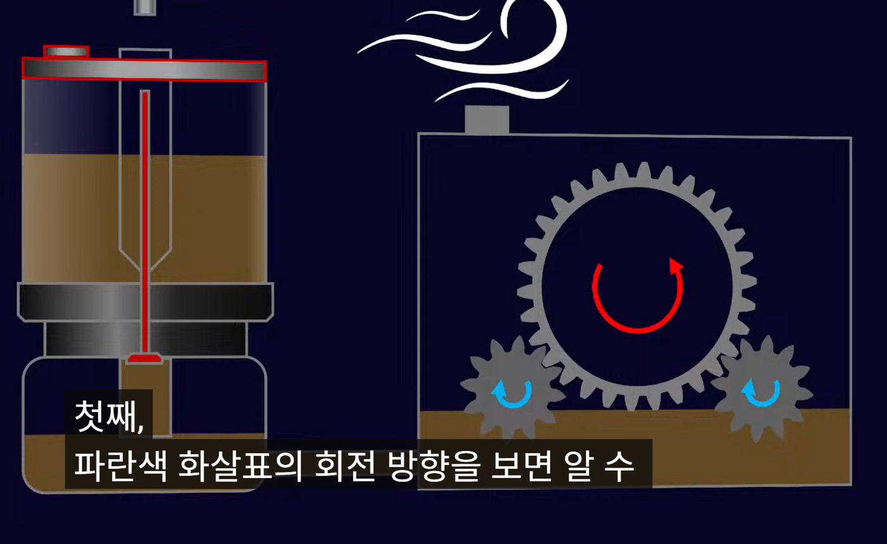

⚠️ **정정/구체화**: "절반"은 케이스마다 다릅니다. 일반 원칙은:
- **롤링 베어링(오일 배스)**: 정지 시 **최하단 볼/롤러의 중심 높이** 정도가 표준
- **기어박스**: OEM이 지정한 **딥스틱/사이트 글라스 범위의 중앙**, 통상 **기어 이(teeth) 하단이 잠기는 정도**
- **과다**: 처닝 → **발열·거품·혼입공기**·동력 손실 (§12)
- **과소**: 유막 부족·국부 과열
- **일정 레벨 급유기(constant level oiler)**: 슬라이드 왼쪽 장치. 소모된 만큼 자동 보충되어 레벨을 일정하게 유지
  → 다만 **회전 방향**을 확인해야 합니다(슬라이드 오른쪽: 회전 방향에 따라 오일이 쓸려 올라가는 쪽이 달라져
  실제 유면과 급유기 설정이 어긋날 수 있음)

### 17.2 그리스 재윤활 — 수동 vs 자동

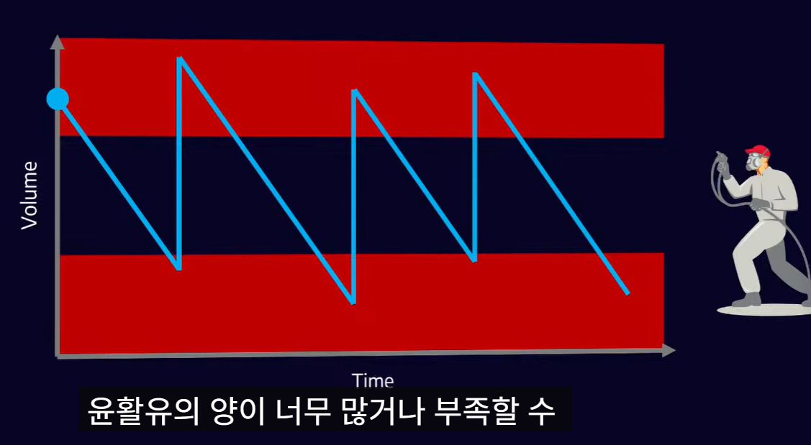
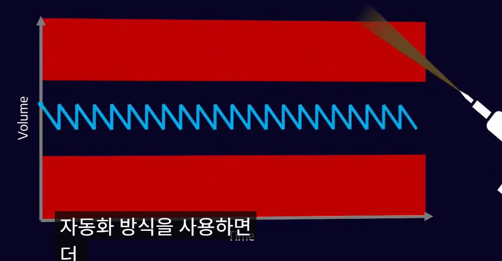

두 그래프가 자동 윤활의 논리를 그림 하나로 설명합니다. (붉은 영역 = 과다 / 과소 = 위험 구간)
- **수동**: 큰 톱니 → 주입 직후 **과다**(발열·씰 파괴·처닝), 주기 말기에는 **과소**(유막 부족).
  즉 대부분의 시간을 "정량"이 아닌 상태로 보냅니다.
- **자동(단일점 윤활기)**: 잦고 작은 양 → **항상 최적 밴드 안**

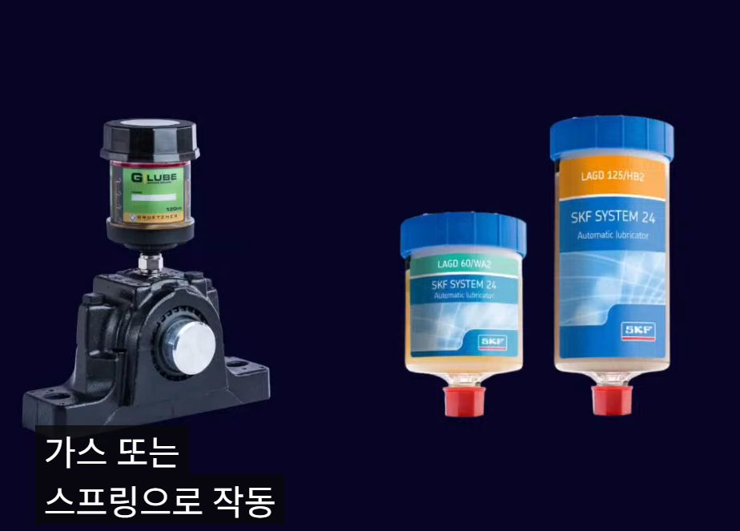

**원 메모(자막 캡처)**: "이런 자동 윤활 장치는 접근하기 매우 어려운 곳에 많이 설치될 겁니다.
문제는 이런 장치는 **설치 후 신경 쓸 필요가 없다는 점**입니다. …그래서 자동 윤활 장치를 설치하고
**1~2년 후에 윤활유를 보충하는 것**(이 되어버립니다)"

**보강 — 자동 윤활기의 3대 함정**
1. **"설치하고 잊는다"**: 카트리지는 수 주~수 개월이면 소진됩니다. 빈 상태로 몇 달~1년을 돌면
   **수동보다 못한 결과**가 됩니다. → 교체 주기를 **정비 계획에 등록**하고 잔량 점검을 표준화.
2. **오작동 감지 불가**: 스프링/가스 구동식은 막히거나 굳어도 겉으로는 정상처럼 보입니다.
   → 토출 확인(그리스 배출 흔적), 초음파·온도 점검 병행.
3. **잘못된 그리스/토출량**: 온도별 토출 속도가 달라집니다(가스식은 특히 온도 의존). 계절 보정 필요.

**보강 — 그리스 양 계산 (현장 경험식)**

$$G\,[\text{g}] = 0.005 \times D \times B$$
(D = 베어링 외경 mm, B = 폭 mm)

주기는 베어링 형식·속도(ndm)·온도·환경에 따라 OEM 표/앱으로 산출하고,
**초음파(마찰음) 또는 온도 기반 조건 급유**로 보정하는 것이 최신 실무입니다.

---

## 18. 보관·취급·입고 검사

**원 메모**
- "오일을 깨끗하게, 시원하고, 건조하게 — **세 가지 유지 프로그램**"
- "서류 확인, 주문 제품 / 딜리버리 제품 비교 확인"
- "너무 높은 온도에 보관 안 좋음"

✅ 이 세 줄이 저장·취급 챕터의 요약입니다.

### 18.1 3원칙: Clean · Cool · Dry

| 원칙 | 이유 | 실행 |
|---|---|---|
| **Clean** | 입자 = 마모의 직접 원인 (§10) | 청정 용기, 전용 급유구, 브리더, 무개방 급유 |
| **Cool** | **10°C ↓ = 수명 2배** (§9.1) | 직사광선 회피, 실내 보관, 쿨러 관리 |
| **Dry** | 산화·가수분해·부식 (§11) | 건조제 브리더, 드럼 눕혀 보관, 실내화 |

### 18.2 입고(수령) 검사 — 메모의 "서류 확인"

1. **발주서 ↔ 납품서 ↔ 드럼 라벨** 3자 대조 (제품명·등급·수량·배치번호)
   → 현장 사고의 상당수가 **오주입/오배송**에서 시작합니다
2. **성적서(CoA)** 확인: 점도, 수분, 청정도(ISO 코드), 필요 시 원소 분석
3. **입고 샘플 채취·보관** (분쟁 대비 리테인 샘플)
4. **신유도 깨끗하지 않다**는 전제로: 필요하면 **입고 시 여과(filter-in)** 후 저장

### 18.3 드럼·그리스 보관

- 옥외 불가피하면 **드럼을 눕히고** 마개를 **3시–9시 방향**으로 (드럼 상부 고임물이 호흡으로 빨려드는 것 방지)
- 온도 사이클 최소화 → 응축 억제
- **FIFO(선입선출)**, 유효기간 관리 (그리스·EAL·에스테르계는 특히 짧음)
- **그리스는 고온 보관 금지** — 기유가 분리(bleeding)되고 주도가 변합니다 (원 메모 그대로)
- **색상·기호 라벨 표준화**: 어떤 설비에 어떤 오일이 들어가는지 **급유구에 태그**
  (§6.4의 호환성 사고를 원천 차단하는 가장 값싼 방법)

---

## 19. 메모 속 물음표 정리 (Q&A)

원 메모에 물음표로 남겨둔 것들을 모아 답을 붙였습니다.

**Q. "API ?" — 엔진오일의 API는 뭘 뜻하나?**
A. 미국석유협회(API)의 **서비스 분류**입니다. 가솔린 = S 계열(현행 **SP**), 디젤 = C 계열(현행 **CK-4 / FA-4**).
기어오일에서는 별도로 **GL 분류**(§7.2)를 씁니다. 두 체계를 혼동하지 않는 것이 포인트입니다.

**Q. "Dn rate?" — 정확한 정의는?**
A. **ndm = 회전수(rpm) × 평균 베어링 지름 d_m(mm)**, d_m = (D+d)/2.
베어링의 속도 가혹도를 하나의 숫자로 표현한 지표이며, **그리스/오일 선택과 점도 선정의 입력값**입니다.
오일 윤활 기준 상한이 볼 ≈ 400,000, 롤러 ≈ 300,000 수준이고 그리스는 그보다 낮습니다.

**Q. "칼슘 설포네이트 그리스(비비누계)와 칼슘 설포네이트 **복합** 그리스(비누 증점제)의 차이?"** (원 메모 마지막 질문)
A.
- **과염기성 칼슘 설포네이트 그리스**: 증점 주체가 **탄산칼슘(칼사이트) 결정** — **비누가 아닙니다**.
  내수성·방청·EP·고온 성능이 뛰어납니다.
- **칼슘 설포네이트 복합(complex) 그리스**: 위 구조에 **칼슘 비누(12-하이드록시스테아르산칼슘, 아세트산칼슘 등)**
  를 더한 것. 증점 효율(yield)과 주도 조절이 좋아지고 원가가 내려가며, 극압·기계적 안정성이 더 향상됩니다.
- 실무 차이: 복합형이 **주도 설계 폭이 넓고 가격 경쟁력**이 있어 상용 제품 다수가 복합형입니다.
  둘 다 리튬계와 비교적 호환성이 좋은 편이라 **리튬 대체 후보 1순위**로 꼽힙니다.

**Q. "그리스 색깔"** → 성능과 무관. 식별용. (§6.4)

**Q. "항상 비싼 게 좋은 건 아니다?"** → 맞습니다. High-loss 시스템에는 표준유 + 누유 개선이 정답. (§7.3)

**Q. "종이 필터는 수분까지 흡수해서 좋다?"** → 부분적으로만 사실, 수분 제거 수단으로 쓰면 안 됨. (§16)

**Q. "STLE는 뭐하는 곳?"** (원 메모 "기계 오일 분석 STLE")
A. **STLE (Society of Tribologists and Lubrication Engineers)** — 트라이볼로지·윤활 분야 학회이며
**CLS(Certified Lubrication Specialist)**, **OMA I/II(Oil Monitoring Analyst)** 자격을 운영합니다.
**ICML**(MLA/MLT 자격)과는 다른 기관이므로 시험 준비 시 구분해야 합니다.

---

## 20. 시험 대비 핵심 숫자 & 용어집

### 20.1 외우면 바로 점수 되는 숫자

| 숫자 | 내용 |
|---|---|
| **1% / 30%** | 윤활유 구매비 = 정비예산 1% 미만, 잘못된 윤활의 영향 = 정비비 최대 30% |
| **10°C = 수명 1/2** | Arrhenius 규칙 (60°C 이상 구간) |
| **220°C** | 열분해 시작 온도 |
| **λ < 1 / 1~3 / ≥3** | 경계 / 혼합 / 유체윤활 |
| **κ ≥ 1, 이상 2~4** | 점도비 |
| **ISO 4406 = >4 / >6 / >14 µm** | 코드 1 증가 = 2배 |
| **NLGI 2 = 265–295** | 혼화주도 0.1 mm (ASTM D217) |
| **200–400 ppm** | 일반 유압유 수분 포화점(대략) |
| **8–10 vol%** | 광유의 용해 공기량 |
| **ASTM D892: 24 / 93.5 / 24 °C** | Seq I / II / III |
| **D2619: 93°C, 48 h, 구리** | 가수분해 안정성(Coke bottle) |
| **ICP 한계 ≈ 5–8 µm** | 큰 입자 검출 불가 |
| **β₁₀=200 → 99.5%** | 여과 효율 |
| **ndm 볼 400k / 롤러 300k** | 오일 윤활 기준 대략 상한 |
| **G = 0.005 × D × B** | 그리스 재윤활량(g) |
| **16/14/11** | 서보·고압 유압 목표 청정도 |

### 20.2 용어집 (영–한)

| English | 한글 | 메모 |
|---|---|---|
| Boundary / Mixed / Hydrodynamic lubrication | 경계 / 혼합 / 유체 윤활 | §3 |
| EHL (Elastohydrodynamic) | 탄성유체윤활 | 구름 접촉 |
| Thickener | 증점제 | 그리스의 스펀지 |
| Worked penetration | 혼화주도 | ASTM D217 |
| Bleed / Bleeding | 기유 분리 | 그리스 열화 |
| Consistency | 주도(굳기) | 점도와 다름 |
| Viscosity Index (VI) | 점도지수 | 온도 민감도 |
| Pour point | 유동점 | 저온 유동 한계 |
| AW / EP | 내마모 / 극압 | 첨가제 |
| ZDDP | 지알킬디티오인산아연 | 아연계 AW |
| Ashless / Zinc-free | 무회분 / 무아연 | §7.3 |
| Additive depletion | 첨가제 소모 | 분해·분리·흡착 |
| Oxidation / Nitration | 산화 / 질화 | §9 |
| Hydrolysis | 가수분해 | §9.4 |
| Varnish / Sludge | 바니시 / 슬러지 | 침적물 |
| Micro-dieseling | 마이크로디젤링 | 기포 압축 발열 |
| Dissolved / Emulsified / Free water | 용해 / 유화 / 자유수 | §11 |
| Saturation point | 포화점 | 온도 의존 |
| Entrained air | 혼입 공기 | 가장 위험 |
| Air release | 공기 방출성 | ASTM D3427 |
| Cavitation | 캐비테이션 | 기포 붕괴 |
| Adhesive / Abrasive wear | 접착(스커핑) / 연삭(스코어링) 마모 | §13 |
| Surface fatigue / Micropitting | 표면 피로 / 미세 피팅 | §13 |
| Fretting | 프레팅 | 미세 진동 마모 |
| Representative sample | 대표 시료 | 오일 분석의 전부 |
| Dead volume | 데드 볼륨 | 채취 전 플러싱 |
| Beta ratio | 베타비 | 여과 효율 |
| Bypass valve | 바이패스 | 열리면 여과 0 |
| Desiccant breather | 건조제 브리더 | 최고 가성비 개조 |
| Kidney loop | 키드니 루프 | 오프라인 여과 |
| Single-point lubricator | 단일점 자동 윤활기 | §17.2 |
| UTTO / STOU | 트랙터 겸용유 | §7.4 |
| EAL | 환경친화 윤활유 | 생분해성 |

---

## 21. MLA I 자격 개요

**원 메모**: "MLA — Machinery lubrication analyst"

⚠️ **정정(명칭)**: 정확한 명칭은 **MLA = Machine Lubricant Analyst** 입니다
(**ICML**, International Council for Machinery Lubrication 주관).
"Machinery Lubrication Technician"은 **MLT** 로 다른 자격입니다 — 헷갈리기 쉬운 지점입니다.

| 항목 | 내용 |
|---|---|
| 주관 | **ICML** |
| 대응 국제 규격 | **ISO 18436-4** Category I |
| 시험 | **100문항 객관식, 3시간, closed book** |
| 합격 | **70%** |
| 응시 요건 | 공학·정비·윤활·오일분석·상태감시 분야에서 **5년(고등교육 또는 실무 훈련 포함)** 수준의 경력/교육 |
| 성격 | **오일 분석 중심**(MLA) vs **현장 윤활 실무 중심**(MLT) |

**주요 시험 범위(대분류)** — 이 노트의 구성이 대체로 이 순서를 따릅니다.
- 정비 전략과 오일 분석의 역할 (§1–2)
- 윤활 기초·윤활유/그리스 특성과 선정 (§3–7)
- 윤활유 열화와 상태 감시 (§9, §15.1)
- **오염 관리와 측정** (§10–12, §16)
- **마모 및 마모 입자 감시** (§13, §15.3)
- **샘플링** (§14)
- 프로그램 운영·보관·취급 (§17–18)

(세부 항목별 배점 비율은 ICML이 공개하는 Body of Knowledge 문서에서 최신본을 확인하는 것이 정확합니다.)

**관련 자격 비교 (보강)**

| 기관 | 자격 | 초점 |
|---|---|---|
| **ICML** | **MLA I / II / III** | **오일 분석·상태 감시** |
| ICML | MLT I / II | 현장 윤활 실무 |
| ICML | MLE | 윤활 엔지니어링(설계·프로그램) |
| **STLE** | **CLS** | 윤활 종합 스페셜리스트 |
| STLE | **OMA I / II** | 오일 모니터링 분석 |

---

## 22. 참고 자료

**규격**
- ASTM D217 (그리스 주도), D445 / ISO 3104 (동점도), D664 (TAN), D892 (기포성), D2272 (RPVOT),
  D2619 (가수분해 안정성), D3427 (공기 방출성), D5185 (ICP), D6304 (칼 피셔 수분), D7843 (MPC)
- ISO 4406 (청정도 코드), ISO 4407 (현미경 계수), ISO 11500 (자동 입자 계수), ISO 16889 (필터 다중통과 시험)
- ISO 6743-4 (유압유 분류), ISO 6743-6 (기어유), DIN 51524-1/2/3 (HL / HLP / HVLP)
- ISO 18436-4 (상태 감시 인력 자격 — MLA 대응)
- API GL-1~GL-6 / MT-1 (기어오일), API S·C 계열 (엔진오일)

**웹 자료 (이 노트 보강에 사용)**
- [Level I Certification for the Machine Lubricant Analyst (MLA) — Machinery Lubrication](https://www.machinerylubrication.com/Read/151/machine-lubricant-analyst)
- [Level I Machine Lubricant Analyst — ICML](https://www.icmlonline.com/exams/)
- [Certification Exams & Requirements — Lubricant.Training](https://lubricant.training/certification-exams-and-requirements/)
- [NLGI Grade — NLGI](https://www.nlgi.org/grease-glossary/nlgi-grade/)
- [Grease Consistency – NLGI Grades Explained — FUCHS](https://www.fuchs.com/us/en/grease-consistency-nlgi-grades-explained/)
- [NLGI consistency number — Wikipedia](https://en.wikipedia.org/wiki/NLGI_consistency_number)
- [Grease Thickeners — Chevron Lubricants](https://www.chevronlubricants.com/en_us/home/learning/about-our-brands/industrial-products/greasethickeners.html)
- [Lithium Complex vs. Calcium Sulfonate Grease — Bell Performance](https://www.bellperformance.com/bell-performs-blog/lithium-complex-vs.-calcium-sulfonate-grease-the-workhorses-of-the-industry)
- [Choosing a High-speed Grease — Machinery Lubrication](https://www.machinerylubrication.com/Read/30210/high-speed-grease)
- [Six Rules of Thumb for Bearing Selection and Use — MRO Magazine](https://www.mromagazine.com/features/six-rules-of-thumb-for-bearing-selection-and-use/)
- [Advantages of Zinc-free Hydraulic Oils — Machinery Lubrication](https://www.machinerylubrication.com/Read/30048/zinc-hydraulic-oils)
- [Understanding Zinc vs. Zinc-Free Hydraulic Oil — AMSOIL Industrial](https://blog.amsoilindustrial.com/2024/10/23/understanding-zinc-vs-zinc-free-hydraulic-oil/)
- [Understanding ISO 4406 Cleanliness Codes — Hy-Pro Filtration](https://www.hyprofiltration.com/blog/iso-4406-cleanliness-codes)
- [Hydraulic Fluid ISO Cleanliness Targets](https://heavyvehicleinspection.com/maintenance/fluids-oils/hydraulic-fluid/iso-cleanliness-targets)
- [Anatomy of a Representative Oil Sample: Sampling Frequency and Location — Machinery Lubrication](https://www.machinerylubrication.com/Read/29773/oil-sampling-frequency)
- [GOOD Oil Analysis Starts With GOOD Sampling Practices — Reliabilityweb](https://reliabilityweb.com/articles/entry/good_oil_analysis_good_sampling_practices)
- [Measuring the Effectiveness of Vacuum Dehydrators — Machinery Lubrication](https://www.machinerylubrication.com/Read/31913/vacuum-dehydrators)
- [Oil contamination by water and methods for its removal — Ecol](https://ecol.eu/en/knowledge-base/oil-contamination-by-water-and-methods-for-its-removal/)
- [The True Cost of Poor Lubrication — Reliabilityweb](https://reliabilityweb.com/articles/entry/the_true_cost_of_poor_lubrication)
- [Lubrication — Maintenance Cost or Opportunity? — Machinery Lubrication](https://www.machinerylubrication.com/Read/773/lubrication-maintenance-cost)
